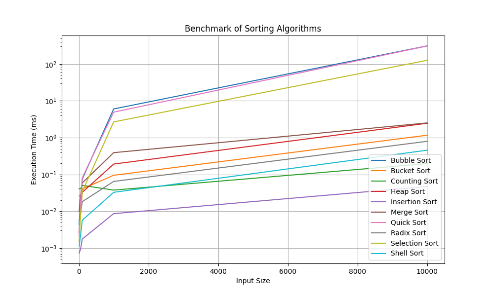

# Sorting Algorithms: Visualization and Benchmarking

## Introduction

This project was built for academic purposes to explore, visualize, and evaluate the performance of various sorting algorithms. Through real-time animated visualizations, learners can observe how each algorithm operates step by step, and compare execution times to analyze efficiency.

The main goal is to highlight the trade-offs between execution time, memory usage, stability, and implementation complexity, providing an insightful overview of each algorithm's characteristics.
## Features
   - Real-time animated visualization for multiple sorting algorithms
   - Runtime benchmarking across different input sizes
   - CSV export of benchmark results
   - Log-scale performance plotting for clearer comparison
     
## Implemented Algorithms

### 1. **Bubble Sort**
   - **Description**: A simple algorithm based on swapping adjacent elements until the list is sorted.
   - **Strengths**:
     - Easy to understand and implement.
     - Stable sort (maintains the relative order of equal elements).
   - **Weaknesses**:
     - Very inefficient for large datasets (O(n²) time complexity).
     - Performs many redundant comparisons and swaps.
   - 

### 2. **Quick Sort**
   - **Description**: A divide-and-conquer strategy that partitions the array around a pivot and recursively sorts the sub-arrays.
   - **Strengths**:
     - Very efficient on average (O(n log n) time complexity).
     - In-place sort (requires only a small amount of additional memory).
   - **Weaknesses**:
     - Worst-case performance is O(n²), though this can be mitigated with randomization or good pivot selection.
     - Unstable sort (may change the relative order of equal elements).
   - 

### 3. **Merge Sort**
   - **Description**: Divides the array into smaller halves, sorts them, and then merges them back together in order.
   - **Strengths**:
     - Consistent O(n log n) time complexity regardless of the input.
     - Stable sort (preserves the order of equal elements).
   - **Weaknesses**:
     - Requires O(n) additional space for merging, which may not be ideal for large arrays.
     - Slower for smaller datasets compared to Quick Sort.
   - 

### 4. **Heap Sort**
   - **Description**: Builds a max-heap from the array and repeatedly extracts the largest element to sort the array.
   - **Strengths**:
     - Time complexity is always O(n log n), even in the worst case.
     - In-place sort, meaning it doesn't require additional memory.
   - **Weaknesses**:
     - Unstable sort.
     - Less cache-friendly compared to Quick Sort.
   - 

### 5. **Insertion Sort**
   - **Description**: Builds the sorted array one element at a time by inserting each element into its correct position in the sorted part of the array.
   - **Strengths**:
     - Efficient for small datasets or nearly sorted arrays (O(n) in best case).
     - Simple and easy to implement.
   - **Weaknesses**:
     - Inefficient for large datasets (O(n²) time complexity).
     - Requires shifting elements during the sorting process, which makes it slower for large unsorted datasets.
   - 

### 6. **Selection Sort**
   - **Description**: Selects the smallest (or largest) element from the unsorted part of the array and places it in the correct position.
   - **Strengths**:
     - Simple and easy to understand.
     - Performs well for small datasets.
   - **Weaknesses**:
     - Inefficient for large datasets (O(n²) time complexity).
     - Unstable sort.
     - No improvement over Bubble Sort in terms of time complexity.
   - 

### 7. **Radix Sort**
   - **Description**: Sorts numbers by processing individual digits, starting from the least significant digit to the most significant.
   - **Strengths**:
     - Can be very efficient for integers or fixed-length strings (O(nk) time complexity).
     - Non-comparative sort, avoiding the overhead of comparisons.
   - **Weaknesses**:
     - Only works for integer keys or strings with a fixed length.
     - Requires additional space (O(n+k)) and may be slower for small datasets.
   - 

### 8. **Bucket Sort**
   - **Description**: Distributes elements into "buckets," sorts them locally, and then merges the sorted buckets together.
   - **Strengths**:
     - Efficient when data is uniformly distributed (O(n+k) time complexity).
     - Can be faster than comparison-based algorithms for specific data distributions.
   - **Weaknesses**:
     - Requires knowledge about the data distribution for efficient bucketing.
     - Not suitable for all types of data (e.g., non-uniform data distributions).
   - 

---


## Algorithm Comparison Table

| Algorithm        | Best Case      | Average Case    | Worst Case      | Space Complexity | Stable   | Notes |
|-----------------|----------------|-----------------|-----------------|------------------|----------|-------|
| Bubble Sort     | O(n)*          | O(n²)           | O(n²)           | O(1)             | Yes      | *Best case assumes optimized implementation with early stopping. |
| Quick Sort      | O(n log n)     | O(n log n)      | O(n²)           | O(log n)**       | No       | **Average recursion stack; worst case can be O(n). |
| Merge Sort      | O(n log n)     | O(n log n)      | O(n log n)      | O(n)             | Yes      | Consistent performance, not in-place. |
| Heap Sort       | O(n log n)     | O(n log n)      | O(n log n)      | O(1)             | No       | In-place, but often less cache-friendly. |
| Insertion Sort  | O(n)           | O(n²)           | O(n²)           | O(1)             | Yes      | Good for small or nearly sorted inputs. |
| Selection Sort  | O(n²)          | O(n²)           | O(n²)           | O(1)             | No       | Simple, but usually outperformed by Insertion Sort. |
| Radix Sort      | O(nk)          | O(nk)           | O(nk)           | O(n + k)         | Yes***   | ***Depends on using a stable subroutine such as Counting Sort. |
| Bucket Sort     | O(n + k)       | O(n + k)        | O(n²)           | O(n + k)         | Depends  | Performance depends heavily on input distribution and bucket strategy. |

## Benchmark Results


*Figure: Execution time comparison of sorting algorithms across different input sizes.*

To compare the runtime performance of the implemented sorting algorithms, run:

```bash
python benchmark_log_plot.py
```

### 1. Benchmark Setup
- Input sizes: 10 → 10,000 elements
- Data type: Random integer arrays
- Each algorithm was tested on identical datasets
- Execution time measured in milliseconds
- Results averaged over multiple runs to reduce noise

Note: The y-axis uses a logarithmic scale to better visualize performance differences across algorithms with significantly different time complexities.
### 2. Observations

   - **Best performance (small scale):**:
     - Insertion Sort performs efficiently for small input sizes due to its low overhead and simple implementation.
   - **Best scalability:**:
     - Counting Sort and Radix Sort demonstrate strong scalability and maintain low execution time as input size increases.
   - **Moderate performance:**:
     - Heap Sort and Merge Sort show stable growth consistent with their O(n log n) time complexity.
   - **Poor scalability:**:
     - Bubble Sort and Selection Sort exhibit rapid performance degradation as input size increases due to their O(n²) complexity.


### 3. Discussion

The benchmark highlights that algorithm efficiency becomes increasingly important as data size grows. While simple algorithms such as Insertion Sort may perform well for small datasets, their performance degrades significantly at larger scales.

Algorithms with better time complexity, such as Heap Sort, Merge Sort, Counting Sort, and Radix Sort, scale more effectively and are better suited for large datasets.

An interesting observation is that Quick Sort performed worse than expected compared to other O(n log n) algorithms. This may be due to:

  - Suboptimal pivot selection (e.g., first/last element)
  - Input distribution (e.g., partially sorted data)
  - Lack of practical optimizations (e.g., hybrid with insertion sort)

These factors can significantly impact Quick Sort’s real-world performance despite its favorable average-case complexity.

### 4. Conclusion
Overall, the benchmark demonstrates that no single algorithm is optimal for all scenarios. Simpler algorithms may be suitable for small datasets, while more advanced algorithms are necessary for handling large-scale data efficiently.

This benchmark also illustrates the gap between theoretical time complexity and real-world performance, where implementation details and input characteristics play a critical role.

### 5. Conclusion
To reproduce the benchmark:
```bash
python benchmark_log_plot.py
```
Install required dependencies:

```bash
pip install matplotlib numpy
```

---
## Technologies Used

- **C++**: Implementation of sorting algorithms.
- **Python**: Visualization and performance benchmarking.
- **Matplotlib**: Used to create charts and export visualizations as GIFs.
- **Git**: Version control.

## Installation and Setup

1. **Clone the repository**:
```bash
   git clone https://github.com/VinhTechiee/Sorting-Algorithms-Visualization-and-Benchmarking.git
   cd Sorting-Algorithms-Visualization-and-Benchmarking
 ```
2. **Install required Python libraries**:
```bash
pip install -r requirements.txt
 ```
3. **Compile the C++ code**:
```bash
g++ src/main.cpp src/SortAlgorithms.cpp -o main
```

4. **Run the visualization**:
```bash
python sorting_algorithms_visualization.py
 ```
5. **Run the benchmark**:
```bash
python benchmark_log_plot.py
 ```

The results will be saved in results.csv and displayed in graphical form.

## Repository Structure
```

Sorting-Algorithms-Visualization-and-Benchmarking
│
├── .gitignore
├── README.md
│
├── src/
│ ├── SortAlgorithms.cpp
│ ├── SortAlgorithms.h
│ ├── main.cpp
│
├── tests/
│ ├── catch_amalgamated.cpp
│ ├── catch_amalgamated.hpp
│ ├── test_sort.cpp
│
├── benchmark_log_plot.py
├── benchmark_plot.png
├── sorting_algorithms_visualization.py
│
├── bubble_sort_visualization.gif
├── bucket_sort_visualization.gif
├── heap_sort_visualization.gif
├── insertion_sort_visualization.gif
├── merge_sort_visualization.gif
├── quick_sort_visualization.gif
├── radix_sort_visualization.gif
├── selection_sort_visualization.gif
│
└── benchmark_results.csv
 ```

### Key Findings
In the benchmark results, Quick Sort performed among the fastest algorithms for large random datasets.Bubble Sort is easy to understand but inefficient.
Bubble Sort was useful for educational visualization but inefficient for large inputs.
The results illustrate trade-offs between runtime, memory use, and algorithm design.

---

## Author
**Le Hien Vinh**  
Ho Chi Minh City University of Technology
