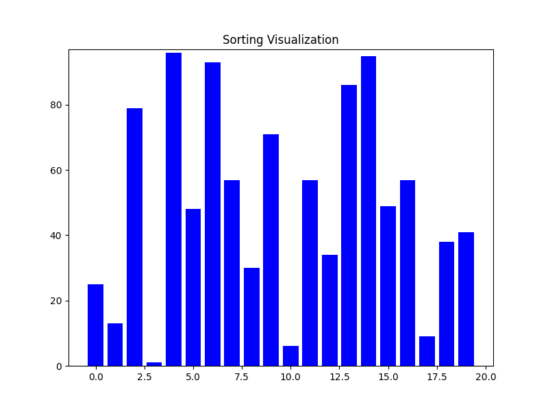
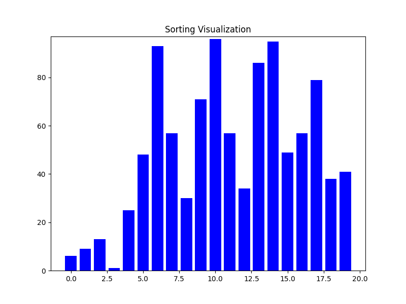
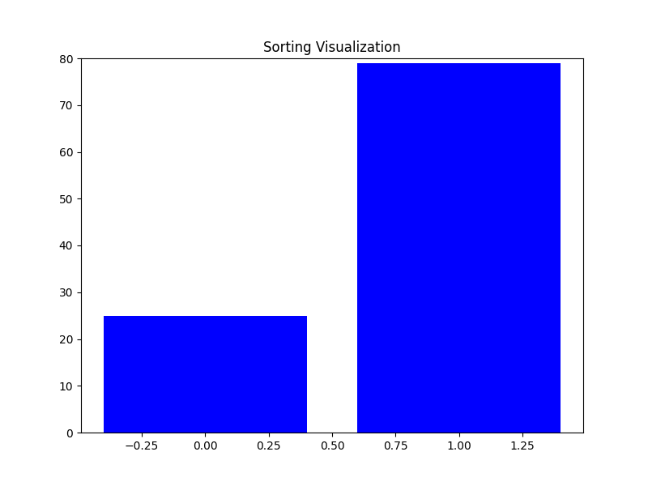
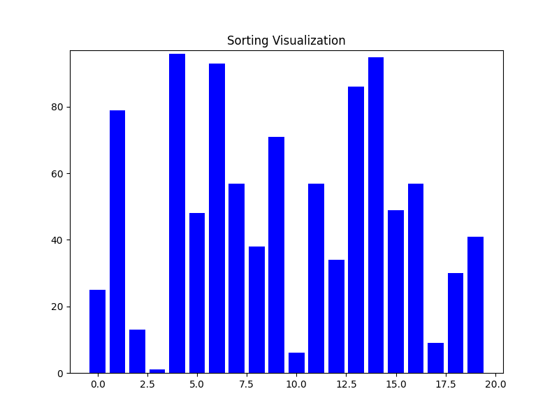
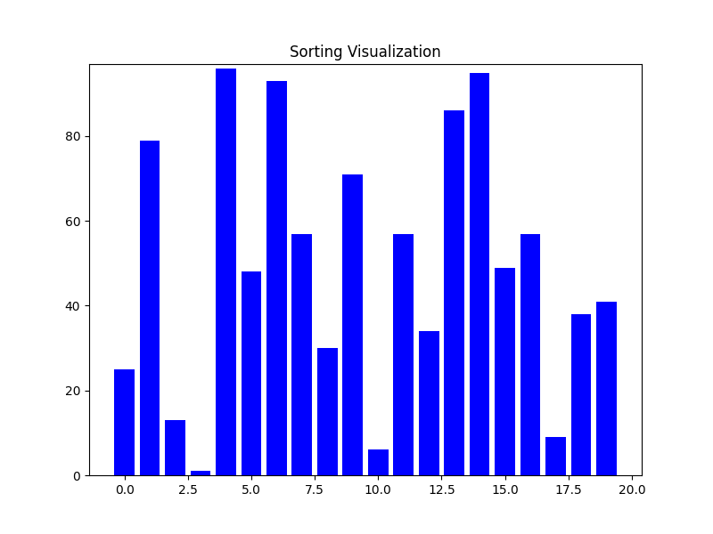
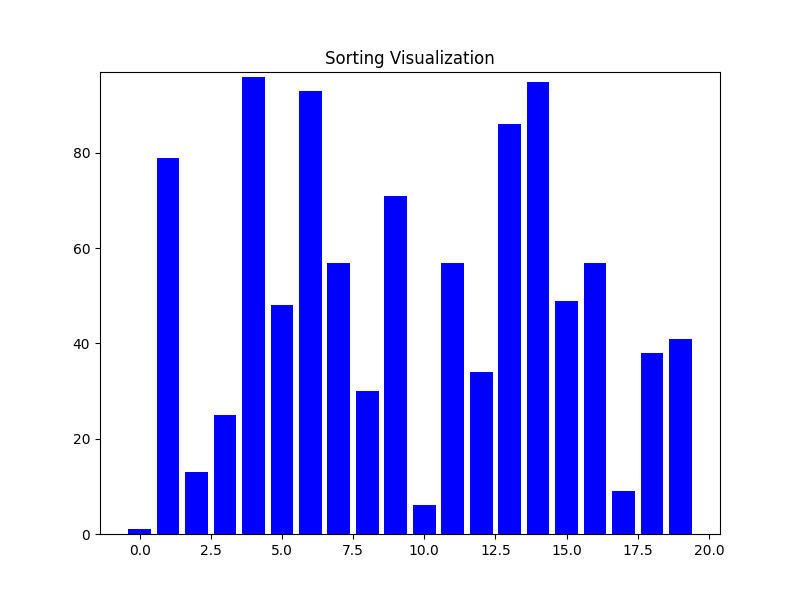
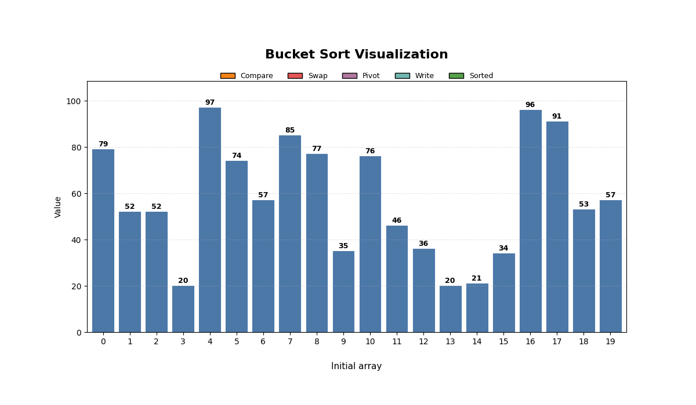

# Sorting Algorithms: Visualization and Benchmarking

## Introduction

This project was built for academic purposes to explore, visualize, and evaluate the performance of various sorting algorithms. Through real-time animated visualizations, learners can observe how each algorithm operates step by step, and compare execution times to analyze efficiency.

The main goal is to highlight the trade-off between processing speed and solution quality, providing an insightful overview of each algorithm's characteristics.

## Implemented Algorithms

### 1. **Bubble Sort**
   - **Description**: A simple algorithm based on swapping adjacent elements until the list is sorted.
   - **Strengths**:
     - Easy to understand and implement.
     - Stable sort (maintains the relative order of equal elements).
   - **Weaknesses**:
     - Very inefficient for large datasets (O(n²) time complexity).
     - Performs many redundant comparisons and swaps.
   - 

### 2. **Quick Sort**
   - **Description**: A divide-and-conquer strategy that partitions the array around a pivot and recursively sorts the sub-arrays.
   - **Strengths**:
     - Very efficient on average (O(n log n) time complexity).
     - In-place sort (requires only a small amount of additional memory).
   - **Weaknesses**:
     - Worst-case performance is O(n²), though this can be mitigated with randomization or good pivot selection.
     - Unstable sort (may change the relative order of equal elements).
   - 

### 3. **Merge Sort**
   - **Description**: Divides the array into smaller halves, sorts them, and then merges them back together in order.
   - **Strengths**:
     - Consistent O(n log n) time complexity regardless of the input.
     - Stable sort (preserves the order of equal elements).
   - **Weaknesses**:
     - Requires O(n) additional space for merging, which may not be ideal for large arrays.
     - Slower for smaller datasets compared to Quick Sort.
   - 

### 4. **Heap Sort**
   - **Description**: Builds a max-heap from the array and repeatedly extracts the largest element to sort the array.
   - **Strengths**:
     - Time complexity is always O(n log n), even in the worst case.
     - In-place sort, meaning it doesn't require additional memory.
   - **Weaknesses**:
     - Unstable sort.
     - Less cache-friendly compared to Quick Sort.
   - 

### 5. **Insertion Sort**
   - **Description**: Builds the sorted array one element at a time by inserting each element into its correct position in the sorted part of the array.
   - **Strengths**:
     - Efficient for small datasets or nearly sorted arrays (O(n) in best case).
     - Simple and easy to implement.
   - **Weaknesses**:
     - Inefficient for large datasets (O(n²) time complexity).
     - Requires shifting elements during the sorting process, which makes it slower for large unsorted datasets.
   - 

### 6. **Selection Sort**
   - **Description**: Selects the smallest (or largest) element from the unsorted part of the array and places it in the correct position.
   - **Strengths**:
     - Simple and easy to understand.
     - Performs well for small datasets.
   - **Weaknesses**:
     - Inefficient for large datasets (O(n²) time complexity).
     - Unstable sort.
     - No improvement over Bubble Sort in terms of time complexity.
   - 

### 7. **Radix Sort**
   - **Description**: Sorts numbers by processing individual digits, starting from the least significant digit to the most significant.
   - **Strengths**:
     - Can be very efficient for integers or fixed-length strings (O(nk) time complexity).
     - Non-comparative sort, avoiding the overhead of comparisons.
   - **Weaknesses**:
     - Only works for integer keys or strings with a fixed length.
     - Requires additional space (O(n+k)) and may be slower for small datasets.
   - 

### 8. **Bucket Sort**
   - **Description**: Distributes elements into "buckets," sorts them locally, and then merges the sorted buckets together.
   - **Strengths**:
     - Efficient when data is uniformly distributed (O(n+k) time complexity).
     - Can be faster than comparison-based algorithms for specific data distributions.
   - **Weaknesses**:
     - Requires knowledge about the data distribution for efficient bucketing.
     - Not suitable for all types of data (e.g., non-uniform data distributions).
   - 

---

### Explanation:
- **Strengths and Weaknesses**: Each algorithm has a description followed by its strengths and weaknesses, helping users choose the right algorithm depending on the scenario.
- **Visualizations**: The animated GIFs are linked to show how each algorithm works in real-time. They are valuable for better understanding the step-by-step process behind each algorithm.

This format combines a detailed comparison with visual aids to help users grasp the concept of each algorithm quickly. If you'd like to further modify or add more algorithms, feel free to let me know!

## Algorithm Comparison

| Algorithm           | Best Case Time Complexity | Worst Case Time Complexity | Space Complexity | Stability   | Characteristics |
|---------------------|---------------------------|----------------------------|------------------|-------------|-----------------|
| **Bubble Sort**      | O(n)                      | O(n²)                      | O(1)             | Stable      | Easy to understand, but inefficient for large data. |
| **Quick Sort**       | O(n log n)                | O(n²)                      | O(log n)         | Unstable    | Fast for large datasets, good partitioning. |
| **Merge Sort**       | O(n log n)                | O(n log n)                 | O(n)             | Stable      | Easy to split and merge arrays. |
| **Heap Sort**        | O(n log n)                | O(n log n)                 | O(1)             | Unstable    | Optimizes memory but slower than Quick Sort. |
| **Insertion Sort**   | O(n)                      | O(n²)                      | O(1)             | Stable      | Suitable for small arrays. |
| **Selection Sort**   | O(n²)                     | O(n²)                      | O(1)             | Unstable    | Easy to implement but inefficient. |
| **Radix Sort**       | O(nk)                     | O(nk)                      | O(n + k)         | Stable      | Suitable for integers, no comparisons needed. |
| **Bucket Sort**      | O(n + k)                  | O(n²)                      | O(n + k)         | Stable      | Distributes data into “buckets.” |

## Technologies Used

- **C++**: Implementation of sorting algorithms.
- **Python**: Visualization and performance benchmarking.
- **Matplotlib**: Used to create charts and export visualizations as GIFs.
- **Git**: Version control.

## Installation and Setup

1. **Clone the repository**:
```bash
   git clone https://github.com/your-username/Sorting-Algorithms-Visualization-and-Benchmarking.git
   cd Sorting-Algorithms-Visualization-and-Benchmarking
 ```
2. **Install required Python libraries**:
```bash
pip install -r requirements.txt
 ```
3. **Compile the C++ code**:
```bash
g++ src/main.cpp src/SortAlgorithms.cpp -o main
```

4. **Run the visualization**:
```bash
python sorting_algorithms_visualization.py
 ```
5. **Run the benchmark**:
```bash
python benchmark_log_plot.py
 ```

The results will be saved in results.csv and displayed in graphical form.

Repository Structure
```

Sorting-Algorithms-Visualization-and-Benchmarking
│
├── .gitignore
├── README.md
│
├── src/
│ ├── SortAlgorithms.cpp
│ ├── SortAlgorithms.h
│ ├── main.cpp
│
├── benchmark_log_plot.py
├── sorting_algorithms_visualization.py
│
├── bubble_sort_visualization.gif
├── bucket_sort_visualization.gif
├── heap_sort_visualization.gif
├── insertion_sort_visualization.gif
├── merge_sort_visualization.gif
├── quick_sort_visualization.gif
├── radix_sort_visualization.gif
├── selection_sort_visualization.gif
│
├── results.csv
└── benchmark_summary.csv
 ```

### Key Findings
Quick Sort is superior in speed for large datasets.
Bubble Sort is easy to understand but inefficient.
Benchmark results show the trade-off between speed and complexity of implementation.


---

## Author
**Le Hien Vinh**  
Ho Chi Minh City University of Technology
